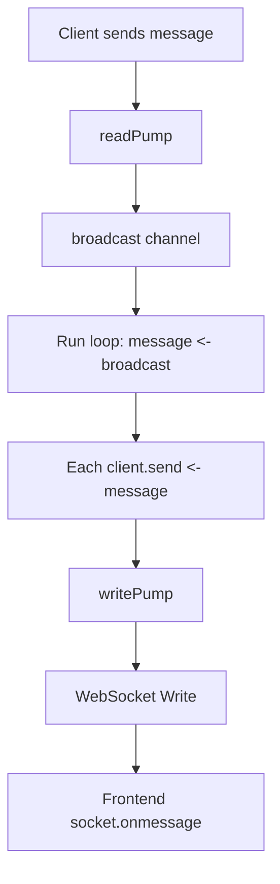

# go-simple-chat part1

## Introduction
A simple real-time chat application built with React (frontend) and Go (backend) using WebSocket for real-time communication
## Example

## Server-client message flow

## Benefits of using both `broadcasst` and client `send` channel
- Decouples message reception and delivery
- Prevents blocking from slow or disconnected clients
## Backend
### Tech Stack
Golang
### `main.go`
- Defines the WebSocket endpoint `/ws`
- Creates a `WsServer` instance
- Starts the `Run()` goroutine to handle client events
- On `/ws` connection, calls `ServeWs()`

### `chatServer.go`
- Defines `WsServer` struct:
    - `clients`: a map of connected clients (client -> boolean)
    - `register`: channels to add clients
    - `unregister`: channels to remove clients
    - `broadcast`: channel to send messages to all clients

- `Run()`:
    - Handles client registration, unregistration, and broadcasting messages

- `broadcastToClients()`:
    - Sends message to all connected clients by pushing to their `send` channel

### `client.go`
- Defines `Client` struct:
    - `conn`: WebSocket connection
    - `send`: channel for messages
    - `wsServer`: reference to the server

- `readPump()`:
    - Reads messages from WebSocket
    - On each message, sends it to server's `broadcast` channel
    - Handles timeouts and disconnects

- `writePump()`:
    - Reads from `send` channel
    - Writes message to the client via WebSocket
    - Sends regular `ping` messages to keep the connection alive

- `disconnect()`:
    - Unregisters the client
    - Closes connection and send channels

- `ServeWs()`:
    - Upgrades HTTP to WebSocket
    - Creates new client
    - Starts read/write goroutines
    - Registers client to server

## Frontend
### Tech Stack
React + TypeScript + Tailwind CSS
### Basic features
- Real-time message via websocket
- Support multiline message
- Scroll to the latest message automatically
## Installation
Clone repo and switch to `part1` branch
```bash
git clone https://github.com/HankStat/go-simple-chat
cd go-simple-chat
git checkout part1
```
Download backend dependencies
```bash
go mod download
```
Go to `backend` folder
```bash
cd backend
```
Create .env file with frontend url inside `backend` folder
```
WS_ALLOWED_ORIGIN=http://localhost:3000
```
Run backend server
```bash
go run ./
```
Go to `frontend` folder
```bash
cd ../
cd frontend/react-ui
```
Create .env file inside the folder with the following 
```
REACT_APP_WS_BASE_URL=ws://localhost:8080
REACT_APP_WS_PATH=/ws
```
Install frontend dependencies
```
npm install
```
Run frontend
```bash
npm start
```
## Reference
1. https://dev.to/jeroendk/building-a-simple-chat-application-with-websockets-in-go-and-vue-js-gao
2. https://emmielin.medium.com/go-chat-application-%E7%B3%BB%E5%88%97%E6%96%87%E7%AB%A0%E7%AD%86%E8%A8%98-%E7%94%A8-golang-%E6%89%93%E9%80%A0%E4%B8%80%E5%80%8B-websocket-%E8%81%8A%E5%A4%A9%E5%AE%A4-server-42faf3777ee2
3. https://github.com/jeroendk/go-vuejs-chat/tree/v1.0